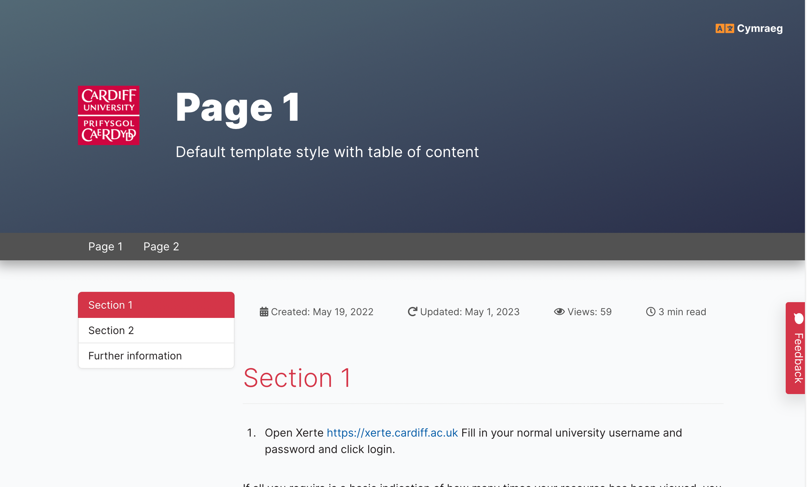

# Adding Welsh Translation Toggle to your Xerte Bootstrap Theme Project

## Introduction
This guide will show you how to add a language translation toggle to your Xerte Bootstrap Theme project. The toggle will allow users to switch between English and Welsh language.

## For Project in English

1. Open your Xerte project
2. Go to first page of your project
3. Make sure **Show Advanced Options** is selected, then click on the **New HTML Code...** 
4. Give it a title such as "Language Toggle Markup", then uncheck **Show Title**.
5. Add the following code to the **HTML Code** field:

    ```html title="HTML Markup"
    <!--Language toggle styles -->

    <!--css styles -->
    <style>
    #language-toggle {
        position: absolute;
        top: 2rem;
        right: 2rem;
        font-size: var(--fs-sm);
        cursor: pointer;
        font-weight: var(--font-weight-7);
        color: var(--white);
        display: flex;
        align-items: center;
    }

    #language-toggle i {
        color: var(--orange-5);
        margin-right: 4px;
        font-size: var(--fs-lg);
    }
    
        #language-toggle-icon {
        width: 25px;
        float: left;
        margin-right: 4px;
    }

    </style>

    <!--HTML markup -->
    <div id="language-toggle" onclick="location.href='#'">
    <i class="fa fa-solid fa-language fa-beat"></i>
        <!-- 
    <div id="language-toggle-icon">-->
        <div>Cymraeg
    </div>
    </div>
    ```
6. Replace ` # ` with the url of the English Project, for example:

    ```html
    <div id="language-toggle" onclick="location.href='https://xerte.cardiff.ac.uk/play_18119'">
    ```

7. Add the following code to the **project info** script field:

    ```javascript title="Project Info Script"
    setTimeout(function(){
        $("#project-info").prependTo("#ultraEssentialssection1");
        $("#cymraeg-icon").prependTo("#overview");
    }, 200);
    ```

8. Click **Play** to preview the changes. You should be able to see the language toggle on the top right corner of the page.

    

## For Project in Welsh

Repeat the steps above but update the html markdown to so that it link back to the English project.

```html title="HTML Markup"
<!--HTML markup -->
<div id="language-toggle" onclick="location.href='#'">
	<i class="fa fa-solid fa-language fa-beat"></i>
	<!--
	<div id="language-toggle-icon">-->
	<div>English</div>
</div>
```